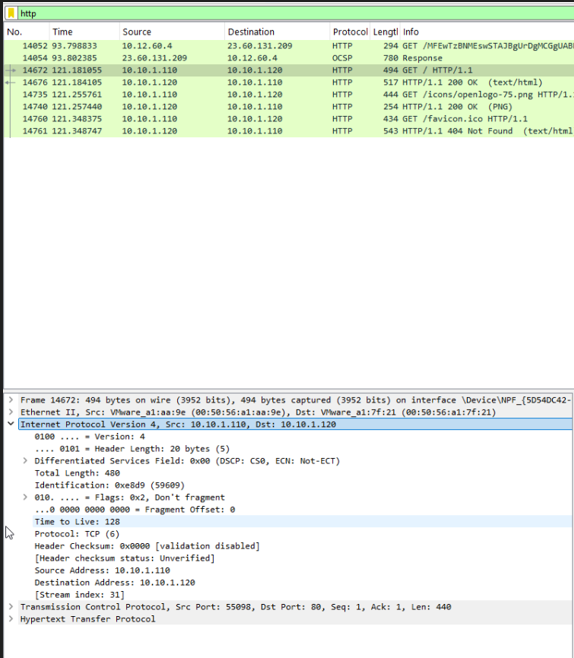
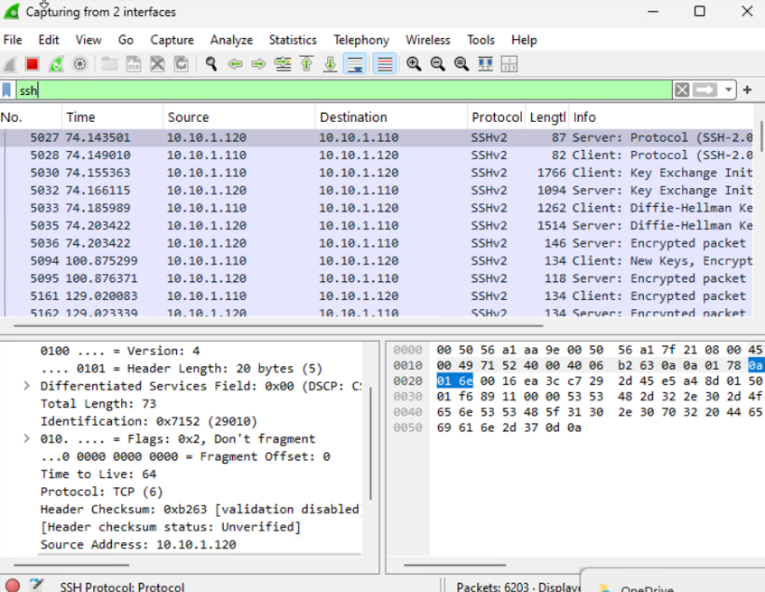
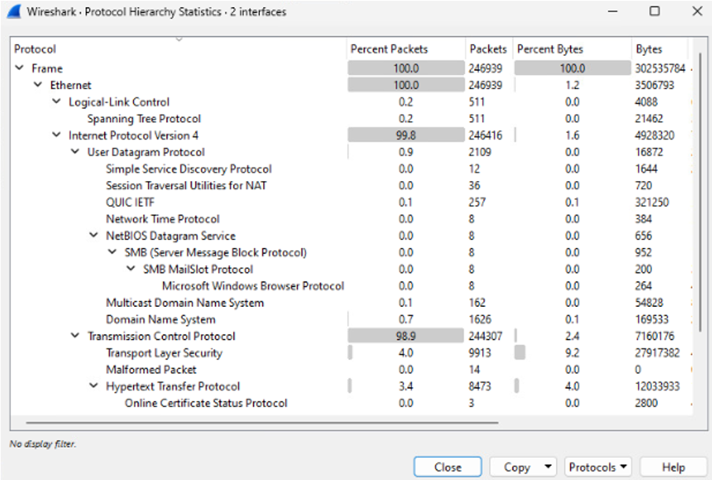

# Wireshark Network Traffic Analysis

## Project Overview

In this project, I used Wireshark in a Windows and Linux virtual lab
environment to capture, filter, and analyze network traffic.

The goal was to understand how common network protocols communicate
and how Wireshark can be used for network troubleshooting and
security analysis.

## Tools Used

- Wireshark
- Windows 11
- Linux
- PuTTY
- Virtual lab environment

## Skills Demonstrated

- Packet capture and traffic filtering
- DNS record analysis
- TCP/IP analysis
- TCP three-way handshake identification
- HTTP and SSH traffic comparison
- IP and MAC address analysis
- Protocol statistics analysis
- Network troubleshooting

## DNS Traffic Analysis

I filtered the packet capture for DNS traffic and examined the DNS
query and response. The response included A records and CNAME records.

- An A record maps a domain name to an IPv4 address.
- A CNAME record maps an alias to its canonical domain name.


## Destination IP Filtering

I used a Wireshark display filter to show only packets sent to the Linux server.

```text
ip.dst == 10.10.1.120
```

The `ip.dst` field filters packets based on their destination IP address. This allowed me to focus on traffic traveling from the Windows client to the Linux server.


*Figure 2: Wireshark display filter showing packets with the Linux server as the destination.*

## TCP Three-Way Handshake

I identified the first three packets used to establish a TCP connection:

1. SYN
2. SYN-ACK
3. ACK

This handshake creates a reliable connection between the client and server.


## HTTP Traffic Analysis

I applied the `http` display filter in Wireshark to examine unencrypted web traffic between the client and web server.

```text
http
```

The captured traffic included:

- HTTP `GET` requests sent by the client
- `HTTP/1.1 200 OK` responses for successfully retrieved resources
- A `404 Not Found` response for a requested resource that was unavailable

This analysis demonstrated how HTTP requests and responses can be identified and examined directly in a packet capture.



*Figure 4: Wireshark capture showing HTTP GET requests, successful 200 OK responses, and a 404 Not Found response.*

## SSH Traffic and Encryption Analysis

I applied the `ssh` display filter in Wireshark to examine Secure Shell communication between the Windows client and Linux server.

```text
ssh
```

The capture showed the SSH connection process, including:

- SSH protocol negotiation
- Key exchange initialization
- Diffie-Hellman key exchange
- Encrypted client and server packets

Unlike unencrypted HTTP traffic, the contents of SSH communication cannot be read directly in Wireshark because SSH encrypts the transmitted data.



*Figure 5: Wireshark capture showing SSHv2 key exchange and encrypted communication between the client and server.*
## Protocol Hierarchy Statistics

I used Wireshark’s Protocol Hierarchy Statistics to examine the distribution of protocols in the packet capture.

The Protocol Hierarchy window organizes traffic by network and application protocol and displays the number and percentage of packets and bytes associated with each protocol.

The analysis showed:

- DNS was the most active visible UDP-based application with 1,626 packets.
- Multicast DNS (mDNS) accounted for 162 packets.
- TLS accounted for 9,913 packets, representing encrypted network communication.
- HTTP accounted for 8,473 packets.



*Figure 6: Wireshark Protocol Hierarchy Statistics showing TCP, UDP, TLS, HTTP, DNS, and mDNS traffic.*
## Key Takeaways

This project helped me understand how DNS, TCP, HTTP, SSH, IP, and MAC
addressing appear inside packet captures. It also demonstrated why
filters and statistical tools are important when analyzing large
amounts of network traffic.
