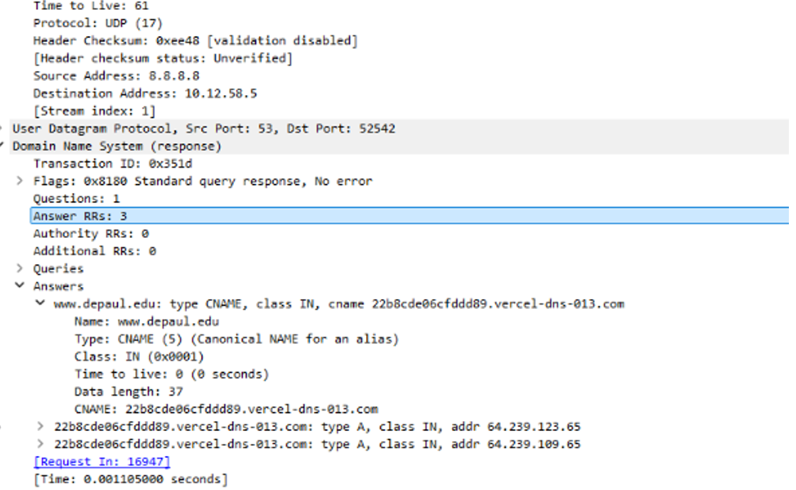
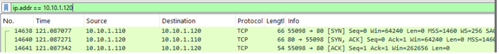

# Wireshark Network Traffic Analysis

## Project Overview

In this project, I used Wireshark in a Windows and Linux virtual lab
environment to capture, filter, and analyze network traffic.

The goal was to understand how common network protocols communicate
and how Wireshark can be used for network troubleshooting and
security analysis.

## Tools Used

- Wireshark
- Windows 11
- Linux
- PuTTY
- Virtual lab environment

## Skills Demonstrated

- Packet capture and traffic filtering
- DNS record analysis
- TCP/IP analysis
- TCP three-way handshake identification
- HTTP and SSH traffic comparison
- IP and MAC address analysis
- Protocol statistics analysis
- Network troubleshooting

## DNS Traffic Analysis

I filtered the packet capture for DNS traffic and examined the DNS
query and response. The response included A records and CNAME records.

- An A record maps a domain name to an IPv4 address.
- A CNAME record maps an alias to its canonical domain name.

## TCP Three-Way Handshake

I identified the first three packets used to establish a TCP connection:

1. SYN
2. SYN-ACK
3. ACK

This handshake creates a reliable connection between the client and server.

## HTTP Traffic Analysis

I filtered HTTP traffic and examined the communication between the
client and web server. I also used Follow TCP Stream to view the request
and response together.

## SSH Encryption Analysis

I compared HTTP and SSH traffic. HTTP traffic was readable in the packet
capture, while SSH traffic was encrypted and could not be viewed in
plain text.

## Protocol Statistics

I used Wireshark's Endpoints, Conversations, and Protocol Hierarchy
features to identify active systems, TCP conversations, and commonly
used protocols.

## Key Takeaways

This project helped me understand how DNS, TCP, HTTP, SSH, IP, and MAC
addressing appear inside packet captures. It also demonstrated why
filters and statistical tools are important when analyzing large
amounts of network traffic.

## Security and Privacy Note

All screenshots were sanitized. Passwords, personal information,
course-provided materials, and sensitive packet-capture data were
excluded from this repository.
